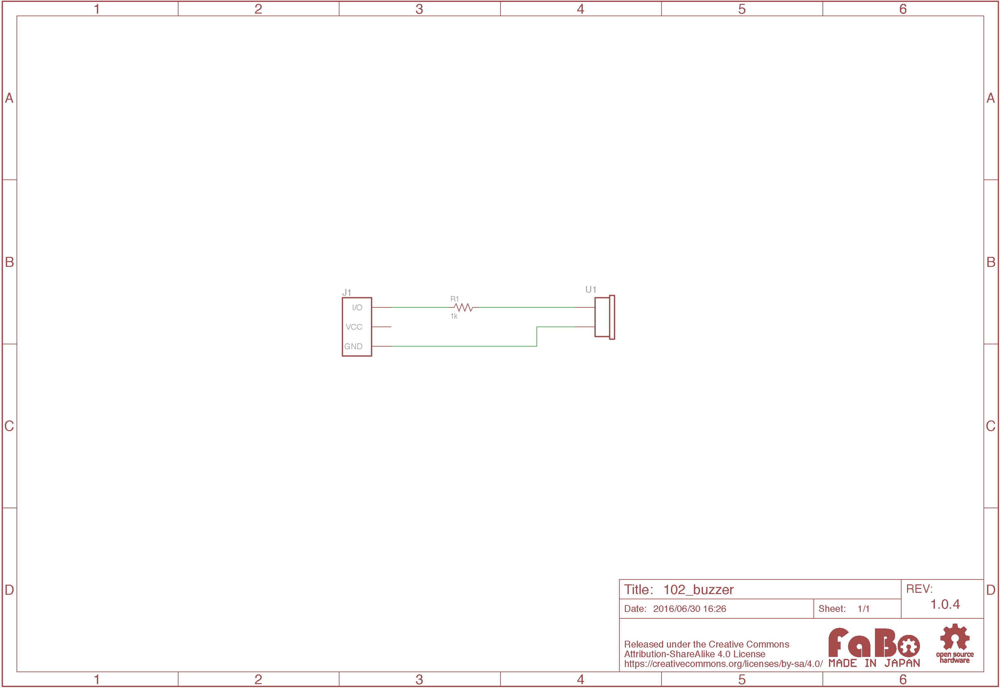

# #102 Buzzer Brick


<!--COLORME-->

## Overview
圧電ブザーを使ったBrickです。I/Oピンより、鳴らす音や音の長さを制御することができます。

## Connecting

OUTコネクタのいずれかに接続します。

## 回路図


## Sample Code

シールドのSOUNDコネクタにBUZZER Brickを接続する。
- ビープ音を鳴らします。

BEEP

```
100 BEEP
```


- MML形式で音を鳴らします。

「ド」は C、「レ」は D　で書きます。※音階は下記のリスト参照。

| C | D | E | F | G | A | B |
| -- | -- | -- | -- | -- | -- | -- | -- |
| ド | レ | ミ | ファ | ソ | ラ | シ |

半音（シャープ）は、C+や、F-　と記述します。<br>

オクターブの変更は　<（下げる）  >（上げる） を使います。

T[値]でテンポを変更できます。

音階の後に数値（1,2,4,8,16,32）をつけると、音の長さを変えられます。（n 分音符。デフォルトは４）
C16 = 16分音符のド

```
100 PLAY"T500CDEFGAB<C2"
```
上記のプログラムを実行すると、<BR>
ドレミファソラシドー<br>
と、最後のドだけ少し長く再生されます。

####注意<br>
一度に再生できるPLAY文は一つだけで、最後に実行したPLAY文のみ再生されます。<br>
```
100 PLAY"CDEFGAB<C"
110 PLAY"F"
```
例えば上記のプログラムを実行すると、「ファ」の１音で終了します。

簡易鍵盤プログラム
```
100 ' BUZZER_sample_program
110 cls
120 PRINT"EASY PIANO"
130 PRINT" SD GHJ"
140 PRINT"ZXCVBNM,"
150 I=INKEY()
160 IF I=ASC("Z") PLAY"C16"
170 IF I=ASC("S") PLAY"C+16"
180 IF I=ASC("X") PLAY"D16"
190 IF I=ASC("D") PLAY"D+16"
200 IF I=ASC("C") PLAY"E16"
210 IF I=ASC("V") PLAY"F16"
220 IF I=ASC("G") PLAY"F+16"
230 IF I=ASC("B") PLAY"G16"
240 IF I=ASC("H") PLAY"G+16"
250 IF I=ASC("N") PLAY"A16"
260 IF I=ASC("J") PLAY"A+16"
270 IF I=ASC("M") PLAY"B16"
280 IF I=ASC(",") PLAY">C16"
290 GOTO 150
```

詳しくは下記のURLを参照してください。<br>
####福野泰介の一日一創 <br>http://fukuno.jig.jp/892

## 構成Parts
- 圧電ブザー

## GitHub
- https://github.com/FaBoPlatform/FaBo/tree/master/102_buzzer
