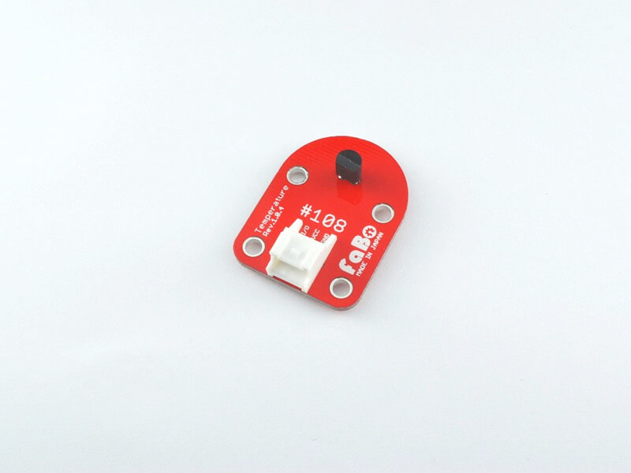
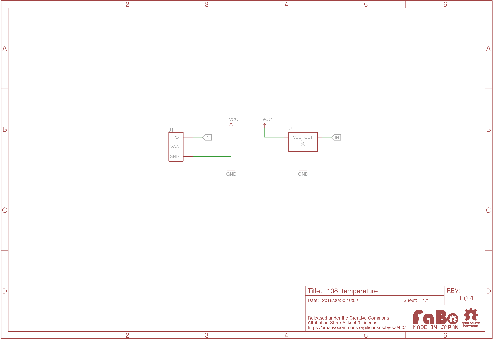

# #108 Temperature Brick

<!--COLORME-->

## Overview
温度を計測するBrickです。

アナログ値(0〜1023)を取得でき、変換することで−30度から100度までの温度を計測することができます。

## Connecting


アナログ用コネクタ(IN2またはANA()で設定したコネクタ)のどれかに接続します。

## LM61CIZ Datasheet
| Document |
|:--|
| [LM61CIZ Datasheet](http://akizukidenshi.com/catalog/g/gI-02726/) |

## 回路図



## Sample Code
#

#####注意<br>アナログはIN2のみで数値取得可能です。
デジタルの場合はIN(2)、アナログの場合がANA(2)とします。

- デジタル<br>
温度の変化によって0か1を返します。<br>
- アナログ<br>
温度の変化によって0から1023を返します。<br>

```
100 'TEMP_sample_program
110 CLS
120 LOCATE 10,8:PRINT "Digital =";IN(2)
130 LOCATE 10,9:PRINT "Analog  =";ANA(2);"  "
140 GOTO 120
```

画面に数字が2つ表示されます。<br>
それぞれリアルタイムで温度の変化で数値が変化します。
デジタル数値は寒いと0、暖かいと1に変化し、アナログ数値は寒いと小さい値（0に近づく）に、暖かいと大きい値（1023に近づく）に変化します。

## 構成Parts
- IC温度センサ LM61CIZ

## GitHub
- https://github.com/FaBoPlatform/FaBo/tree/master/108_temperature
