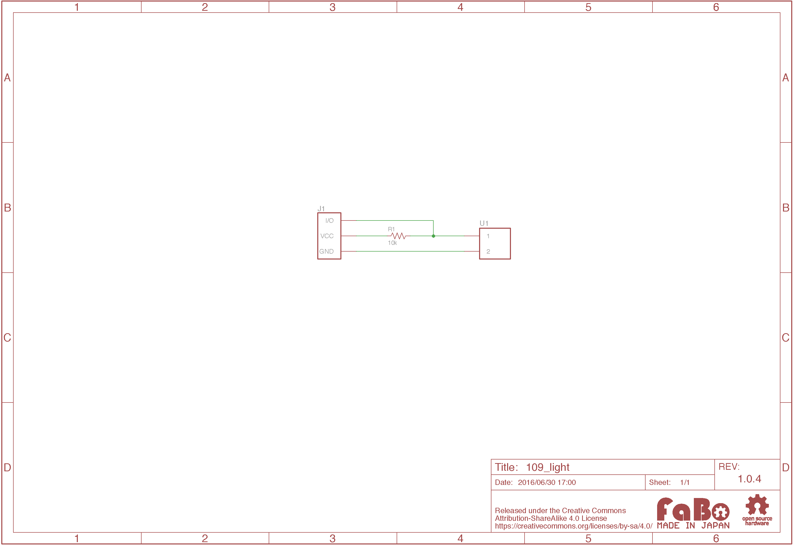

# #109 Light Brick


<!--COLORME-->

## Overview
CDSセルを使用した光センサーBrickです。

周囲の明るさの変化をアナログ値として取得することができます。

## Connecting

アナログ用コネクタ(IN2またはANA()で設定したコネクタ)のどれかに接続します。

## Parts Specification
| Document |
|:--|
| [MI527](http://akizukidenshi.com/catalog/g/gI-00110/) |

## 回路図


## Sample Code

#####注意<br>アナログはIN2のみで数値取得可能です。
デジタルの場合はIN(2)、アナログの場合がANA(2)とします。

- デジタル<br>
光の変化によって0か1を返します。<br>
- アナログ<br>
光の変化によって0から1023を返します。<br>

```
100 'LIGHT_sample_program
110 CLS
120 LOCATE 10,8:PRINT "Digital =";IN(2)
130 LOCATE 10,9:PRINT "Analog  =";ANA(2);"  "
140 GOTO 120
```

画面に数字が2つ表示されます。<br>
それぞれリアルタイムで光の変化で数値が変化します。
デジタル数値は明るいと０、暗いと１に変化し、アナログ数値は明るいと小さい値（0に近づく）に、暗いと大きい値（1023に近づく）に変化します。

## 構成Parts
- CDSセル(5mm)

## GitHub
- https://github.com/FaBoPlatform/FaBo/tree/master/109_light
