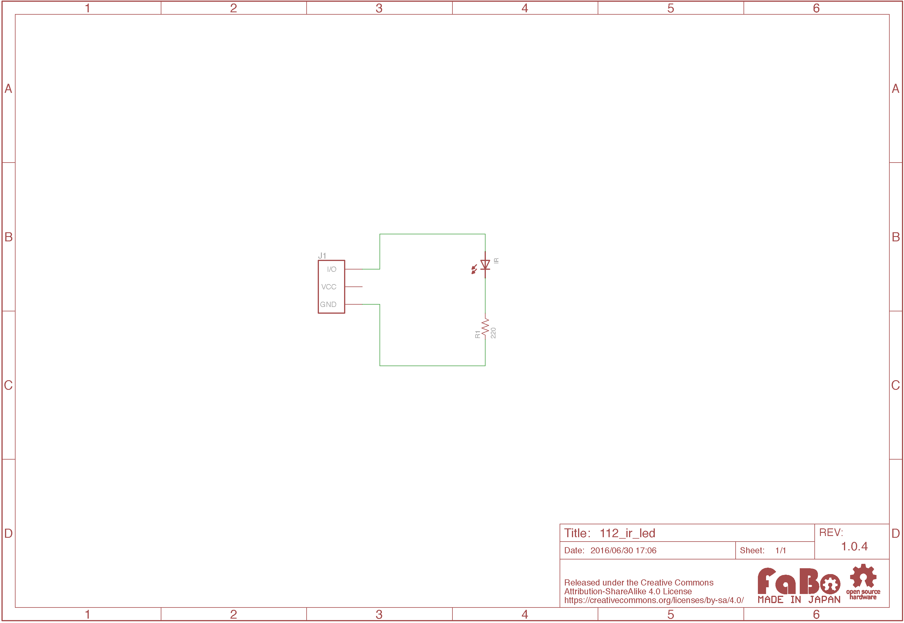

# #112 IR LED Brick


<!--COLORME-->

## Overview
赤外線LEDを使ったBrickです。

I/Oピンから赤外線LEDをON/OFFを制御することができます。

## Connecting

OUTコネクタのいずれかに接続します。

## Parts Specification
| Document |
|:--|
| [OSI5LA5113A](http://akizukidenshi.com/catalog/g/gI-04311/) |

## 回路図


## Sample Code

IN1コネクタにButton Brickを接続し、LEDコネクタに接続したIR LED Brickの点灯/消灯を制御しています。
```
100 ' IN(n) sample program
110 B=IN(1)
120 IF B=1 LED 1 ELSE LED 0
130 GOTO 110
```
## 構成Parts
- 5mm 赤外線LED OSI5LA5113A

## GitHub
- https://github.com/FaBoPlatform/FaBo/tree/master/112_ir_led
