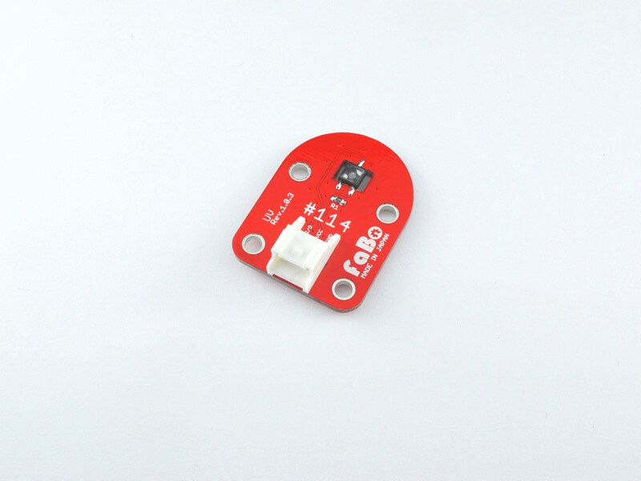
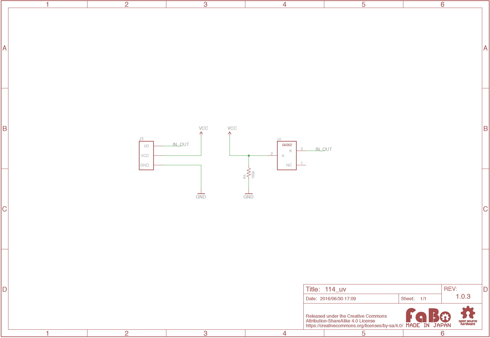

# #114 UV Brick


<!--COLORME-->

## Overview
紫外線センサーを使用したBrickです。I/Oピンより、紫外線の強弱をアナログ値(0〜1023)で取得することができます。

## Connecting

アナログ用コネクタ(IN2またはANA()で設定したコネクタ)のどれかに接続します。

## 回路図


## Sample Code

```Basic
100 'UV_sample_program
110 CLS
120 LOCATE 10,8:PRINT "Digital =";IN(2)
130 LOCATE 10,9:PRINT "Analog  =";ANA(2);"  "
140 GOTO 120
```
紫外線に反応して数値が変化します。

## 構成Parts
- GaAsPフォトダイオードG6262

## GitHub
- https://github.com/FaBoPlatform/FaBo/tree/master/114_uv
