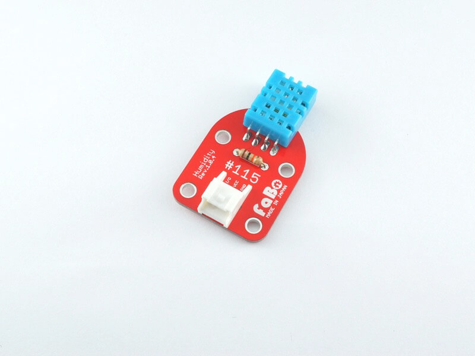
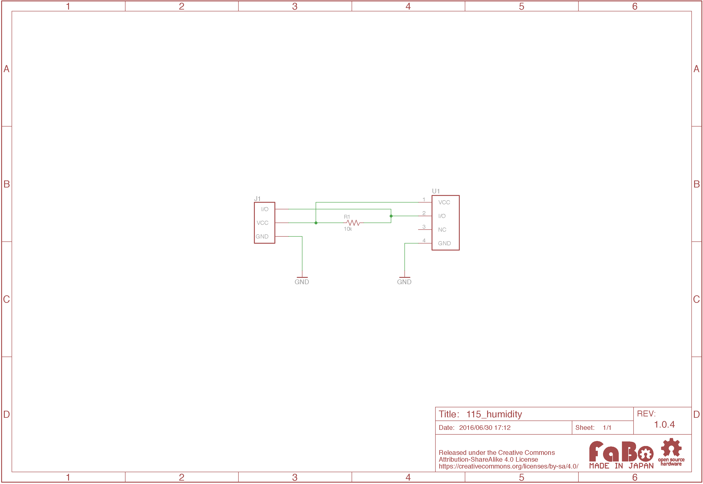

# #115 Humidity Brick(非対応)

本製品はIchigoJamには非対応です。

<!--COLORME-->

## Overview
湿度センサーモジュールを使用したBrickです。

温度、湿度の情報を取得することができます。

## Parts Specification
| Document |
|:--|
| [DHT11](http://akizukidenshi.com/catalog/g/gM-07003/) |

## 回路図

## Parts
- 湿温度センサモジュールDHT11

## GitHub
- https://github.com/FaBoPlatform/FaBo/tree/master/115_humidity
