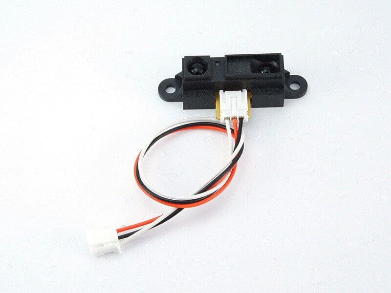

# #116 Distance Brick


<!--COLORME-->

## Overview
距離センサーモジュールを使用したBrickです。

I/Oピンより距離センサーの正面についているレンズから物体までの距離をアナログ値(0〜1023)で取得することができます。

測定可能な距離は10〜80cmとなっています。

## Connecting

アナログ用コネクタ(IN2またはANA()で設定したコネクタ)のいずれかに接続します。

## GP2Y0A21YK Datasheet
| Document |
| -- |
| [GP2Y0A21YK Datasheet](http://www.sharpsma.com/webfm_send/1208) |

## Sample Code

IN2コネクタにDistance Brickを接続して、距離に応じたアナログ値を取得し画面上に出力します。

```
100 'Distance_sample_program
110 CLS
120 LOCATE 0,3:PRINT "Analog  =";ANA(2);"  "
130 GOTO 120
```

## 構成Parts
- 距離センサーモジュール GP2Y0A21YK

## GitHub
- https://github.com/FaBoPlatform/FaBo/tree/master/116_distance
