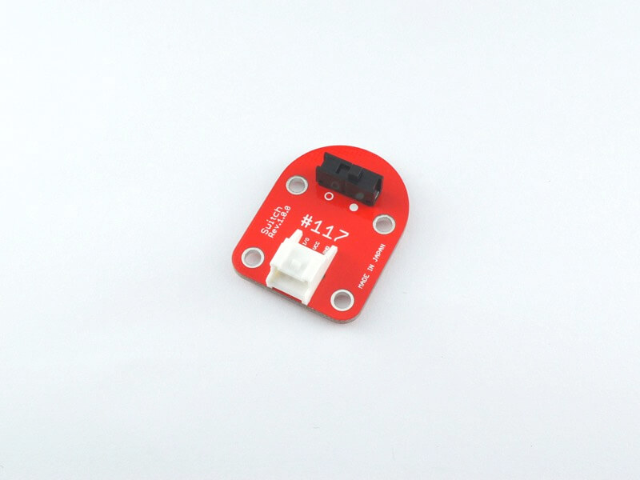

# #117 Switch Brick

<!--COLORME-->

## Overview
スライドスイッチを使用したBrickです。

I/OピンよりスライドスイッチのON/OFFをデジタル値で取得できます。

## Connecting

OUTコネクタのいずれかに接続します。

## 回路図

## Sample Code
### for Arduino

### for Raspberry PI

### for IchigoJam

## Parts
- スライドスイッチ

## GitHub
