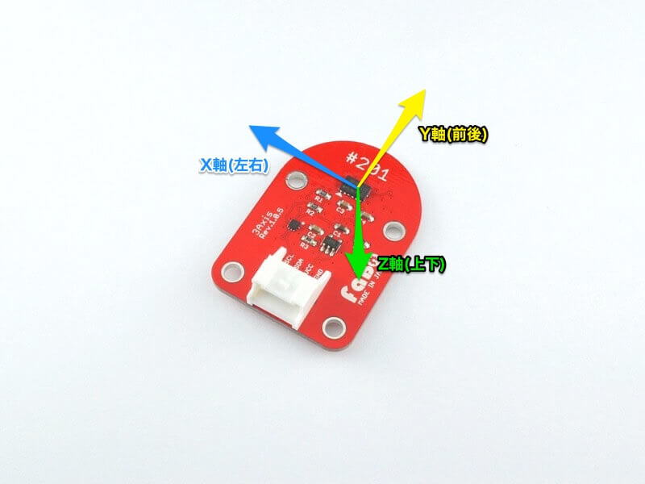

# #201 3Axis I2C Brick


<!--COLORME-->

## Overview
3軸加速度センサーを使用したBrickです。

I2Cで3軸の加速度データを取得することがきます。

## センサー取得データについて
このBrickでは下の図の3軸の値を取得します。



それぞれ矢印の方向に力がかかるとプラス、逆方向ではマイナスとなります。

なお、このBrickを水平に置いた場合、重力がZ軸にかかっている状態となるので、X軸、Y軸が0に近く、Z軸のみ高い値となります。

## Connecting
4Pinケーブルで、OUT/INシールドのI2Cコネクタへ接続します。

※4Pinケーブル、各種OUT/INシールド、各種ケースは別売です。

## ADXL345 Datasheet
| Document |
|:--|
| [ADXL345 Datasheet](http://www.analog.com/media/en/technical-documentation/data-sheets/ADXL345.pdf) |

## Register
| I2C Slave Address |
|:-- |
| 0x53 |

## 回路図


## Library

I2Cコネクタに接続した3Axis I2C Brickより３軸の加速度情報を取得し、画面上に出力します。
```
10 'FaBo Brick Sample
20 '#201 3axis I2C Brick
30 CLS
100 'Slave address
110 C=#53
200 'Address set
210 POKE #800,#31,0,#2D,8
220 POKE #810,#32,6
300 'init
310 A=I2CW(C,#800,1,#801,1)
320 A=I2CW(C,#802,1,#803,1)
400 'Read 3axis data
410 A=I2CW(C,#810,1,#811,1)
420 A=I2CR(C,#810,1,#820,6)
500 'Output
510 LOCATE 0,3
520 ?"X:";PEEK(#820)+PEEK(#821)*256;"  "
530 ?"Y:";PEEK(#822)+PEEK(#823)*256;"  "
540 ?"Z:";PEEK(#824)+PEEK(#825)*256;"  "
600 'loop
610 WAIT 5
620 GOTO 410
```


## Parts
- Analog Devices ADXL345

## GitHub
- https://github.com/FaBoPlatform/FaBo/tree/master/201_3axis
