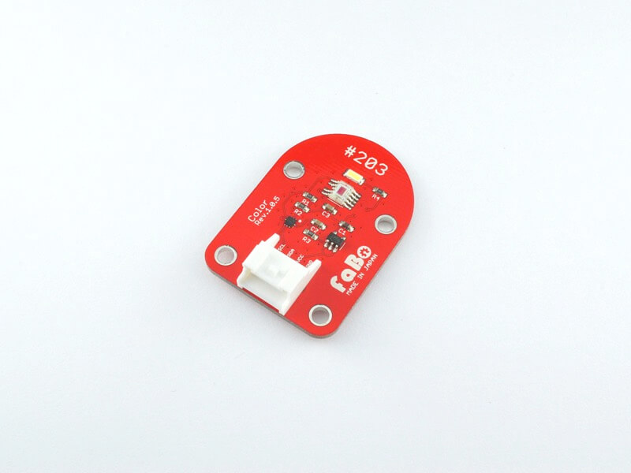
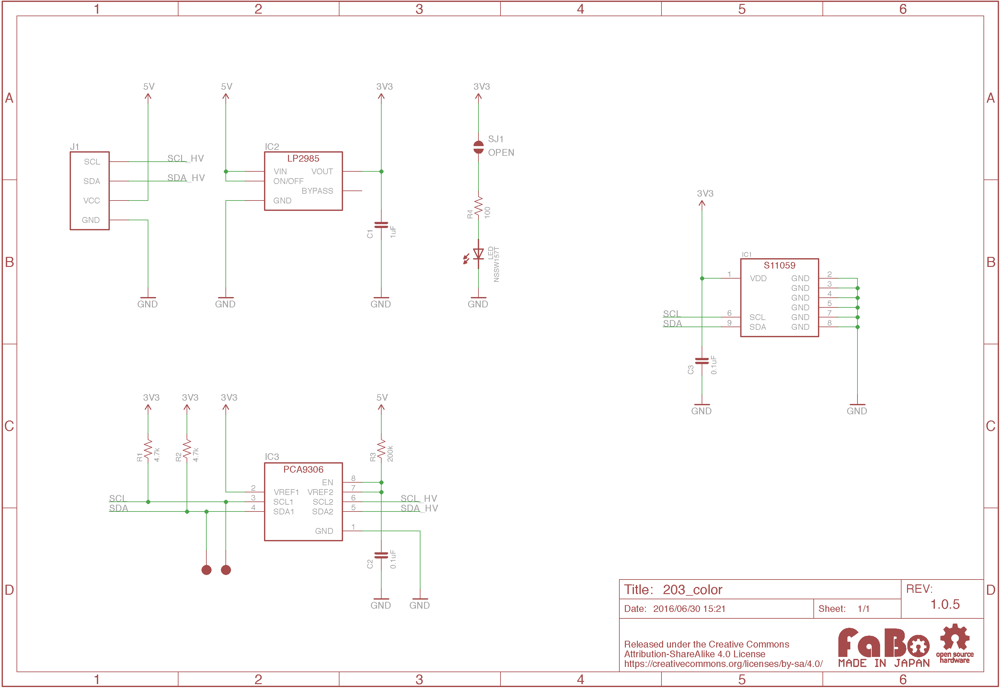

# #203 Color I2C Brick


<!--COLORME-->

## Overview
カラーセンサを使用したBrickです。

センサーより読み取った赤、緑、青、赤外線(明るさ)の4つのデータを、I2Cにて取得することができます。

## Connecting
I2Cコネクタへ接続します。

## S11059 Datasheet
| Document |
| -- |
| [S11059 Datasheet](http://www.hamamatsu.com/resources/pdf/ssd/s11059-02dt_etc_kpic1082j.pdf) |

## Register
| Slave Address |
| -- |
| 0x2A |

## 回路図


## SampleCode

I2Cコネクタに接続したColor Brickにより、赤、緑、青、赤外の値を読み取り、画面上に出力します。

```
10 'FaBo Brick Sample
20 '#203 Color I2C Brick
30 CLS
100 'Slave address
110 D=#2A
200 'Address set
210 POKE #800,#00,#83,#03
220 POKE #810,#00,11
300 'init
310 A=I2CW(D,#800,1,#801,1)
320 A=I2CW(D,#800,1,#802,1)
320 A=I2CW(D,#802,1,#800,1)
400 'Read RGB IR data
410 A=I2CW(D,#810,1,#811,1)
420 A=I2CR(D,#810,1,#820,11)
500 'Output
510 LOCATE 0,3
520 ?"R;";PEEK(#824)/2+PEEK(#823)*128;"    "
530 ?"G;";PEEK(#826)/2+PEEK(#825)*128;"    "
540 ?"B;";PEEK(#828)/2+PEEK(#827)*128;"    "
550 ?"IR;";PEEK(#830)/2+PEEK(#829)*128;"    "
600 'loop
610 WAIT 20
620 GOTO 410
```

## Parts
- HAMAMATSU S11059

## GitHub
- https://github.com/FaBoPlatform/FaBo/tree/master/203_color
