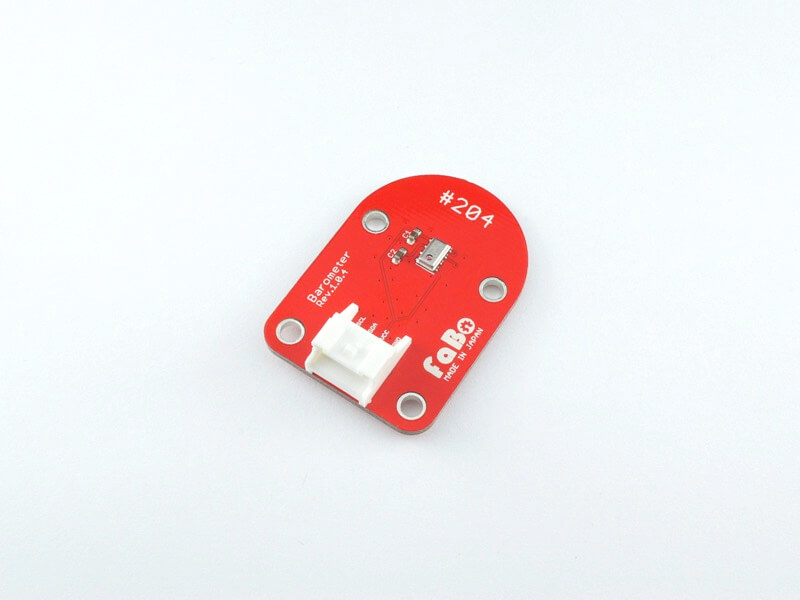

# #204 Barometer I2C Brick

<!--COLORME-->

## Overview
大気圧センサを使用したBrickです。

I2Cでデータを取得できます。

## Connecting
I2Cコネクタへ接続します。

## MPL115A2 Datasheet
| Document |
| -- |
| [MPL115A2 Datasheet](http://cache.freescale.com/files/sensors/doc/data_sheet/MPL115A2.pdf) |

## Register
| Slave Address |
| -- |
| 0x60 |

## 回路図

## Parts
- Freescale(NXP) MPL115A2

## GitHub
- https://github.com/FaBoPlatform/FaBo/tree/master/204_barometer
