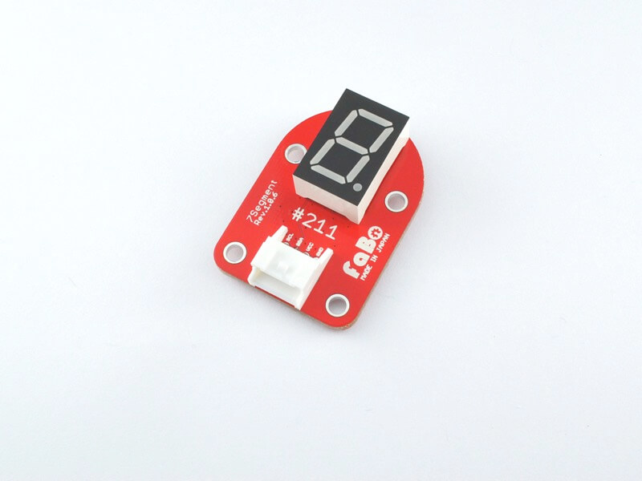
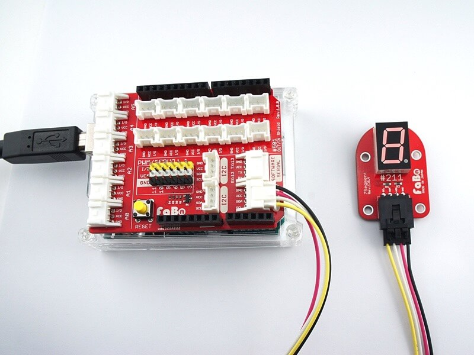
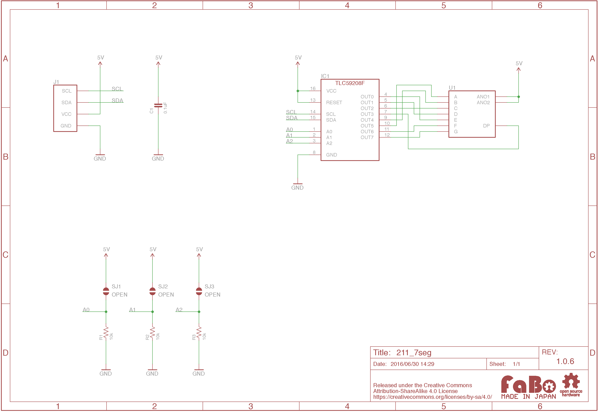

# #211 7Segment LED I2C Brick


<!--COLORME-->

## Overview
７セグメントLEDを使ったBrickです。

I2Cで表示パターンを制御できます。

## Connecting
I2Cコネクタへ接続します。



## TLC59208F Datasheet
| Document |
| -- |
| [TLC59208F Datasheet](http://www.ti.com/jp/lit/gpn/tlc59208f) |

## Register
| A0 | A1 | A2 | Slave Address |
| -- | -- | -- | -- |
| LOW | LOW | LOW | 0x20 |

FaBo Brickでは、初期値に0x20が設定されています。Brick裏面のソルダージャンパーで設定を変更できます。

## 回路図


## Sample Code

I2Cコネクタに7seg Brickを接続し、「0〜９」、「.」を順番に表示させます。

```
10 '#211 7Segment I2C Brick
20 CLS
110 D=#20
210 POKE #800,#80,#A2
220 POKE #810,#81,#3,0,0,0,0,0,0,0,0,#FF,0,#AA,#AA,#92,#94,#98,#D0
225 POKE #830,#2,#2,#2,0,#2,#2,#2,0
230 POKE #838,0,0,#2,0,#2,0,0,0
235 POKE #840,#2,#2,0,0,#2,#2,0,#2
240 POKE #848,0,#2,#2,0,#2,#2,0,#2
245 POKE #850,0,0,#2,0,#2,#0,#2,#2
250 POKE #858,0,#2,#2,0,0,#2,#2,#2
255 POKE #860,#2,#2,#2,0,0,#2,#2,#2
260 POKE #868,0,0,#2,0,#2,#2,#2,0
265 POKE #870,#2,#2,#2,0,#2,#2,#2,#3
270 POKE #878,0,#2,#2,0,#2,#2,#2,#2
275 POKE #880,0,0,0,#2,0,0,0,0

310 A=I2CW(D,#800,1,#810,18)
320 C=0

410 LOCATE 0,3
415 PRINT "Number:";C;" "
420 IF C=0 A=I2CW(D,#801,1,#830,8)
425 IF C=1 A=I2CW(D,#801,1,#838,8)
430 IF C=2 A=I2CW(D,#801,1,#840,8)
435 IF C=3 A=I2CW(D,#801,1,#848,8)
440 IF C=4 A=I2CW(D,#801,1,#850,8)
445 IF C=5 A=I2CW(D,#801,1,#858,8)
450 IF C=6 A=I2CW(D,#801,1,#860,8)
455 IF C=7 A=I2CW(D,#801,1,#868,8)
460 IF C=8 A=I2CW(D,#801,1,#870,8)
465 IF C=9 A=I2CW(D,#801,1,#878,8)
470 IF C=10 A=I2CW(D,#801,1,#880,8)
480 C=C+1
490 IF C>10 C=0

510 WAIT 50
520 GOTO 410
```

## 構成Parts
- 7セグメントLED
- Texas Instruments TLC59208F

## GitHub
- https://github.com/FaBoPlatform/FaBo/tree/master/211_7seg
