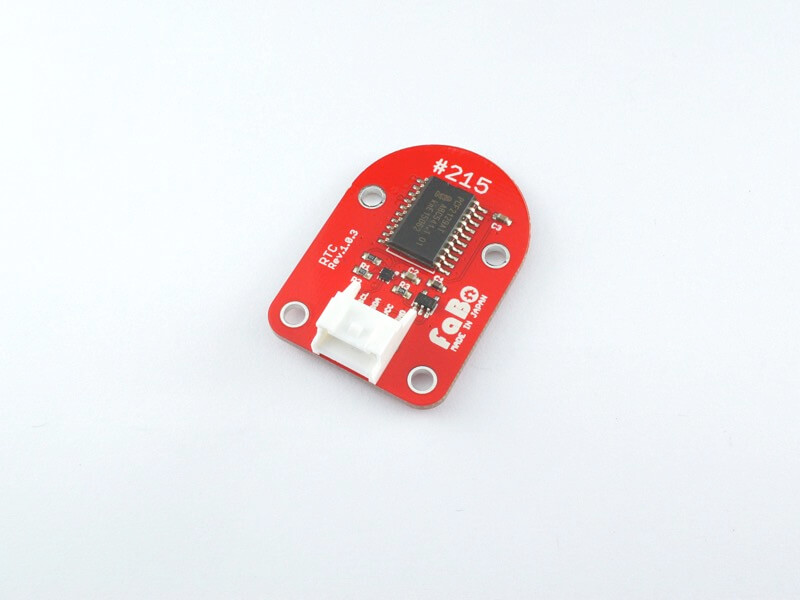
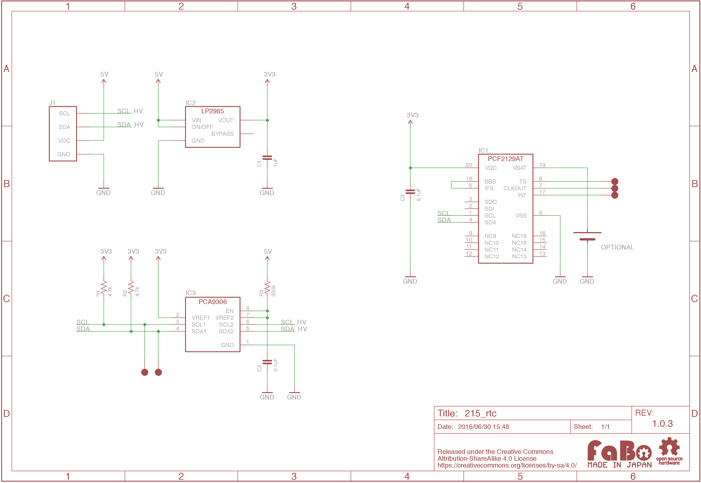

# #215 RTC I2C Brick


<!--COLORME-->

## Overview
リアルタイムクロックを使用したBrickです。
I2Cでデータを取得できます。

## Connecting
I2Cコネクタへ接続します。


## PCF2129 Datasheet
| Document |
| -- |
| [PCF2129 Datasheet](http://cache.nxp.com/documents/data_sheet/PCF2129.pdf) |

## Register
| Slave Address |
| -- |
| 0x51 |

## 回路図


## Sample Code

I2CコネクタにRTC Brickを接続し、指定したい日時からの正確な経過時間を計測してシリアルモニタに出力します。

```
10 'FaBo Brick Sample
20 '#215 RTC I2C Brick

30 CLS

100 'Slave address
110 D=#51
200 'Address set
210 POKE #800,#03,#02
220 'sec, min, hor, day, weekday, mon, year(20XX)
230 POKE #820,54,30,12,7,2,6,16

240 POKE #830,(PEEK(#820)/10)<<4+PEEK(#820)%10+#80
241 POKE #831,(PEEK(#821)/10)<<4+PEEK(#821)%10
242 POKE #832,(PEEK(#822)/10)<<4+PEEK(#822)%10
243 POKE #833,(PEEK(#823)/10)<<4+PEEK(#823)%10
244 POKE #834,PEEK(#824)
245 POKE #835,(PEEK(#825)/10)<<4+PEEK(#825)%10
246 POKE #836,(PEEK(#826)/10)<<4+PEEK(#826)%10

300 'time set
310 A=I2CW(D,#800,1,#830,7)

410 'time read
420 A=I2CR(D,#801,1,#840,7)

500 'Output
510 LOCATE 0,3
520 ?"Year";(PEEK(#846)>>4)*10+PEEK(#846)&#F+2000
521 ?"mon ";(PEEK(#845)>>4)*10+PEEK(#845)&#F;" "
522 ?"wd  ";(PEEK(#844)>>4)*10+PEEK(#844)&#F;" "
523 ?"day ";(PEEK(#843)>>4)*10+PEEK(#843)&#F;" "
524 ?"hor ";(PEEK(#842)>>4)*10+PEEK(#842)&#F;" "
525 ?"min ";(PEEK(#841)>>4)*10+PEEK(#841)&#F;" "
526 ?"sec ";(PEEK(#840)>>4)*10+PEEK(#840)&#F;" "
600 'loop
610 WAIT 10
620 GOTO 420
```

## 構成Parts
- NXP PCF2129

## GitHub
- https://github.com/FaBoPlatform/FaBo/tree/master/215_rtc
