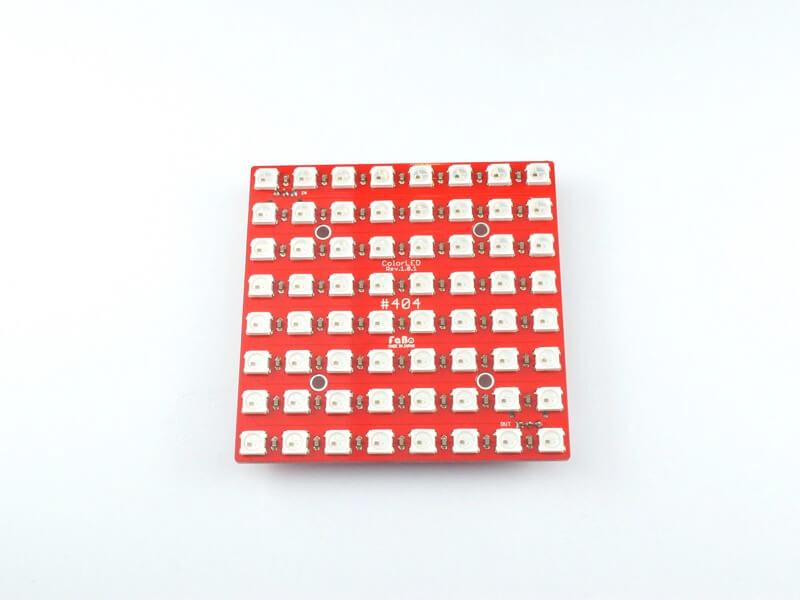
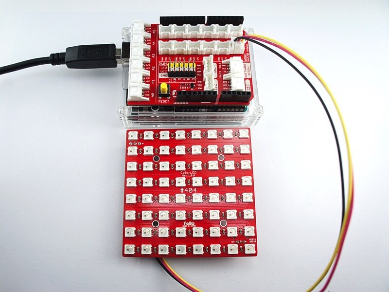
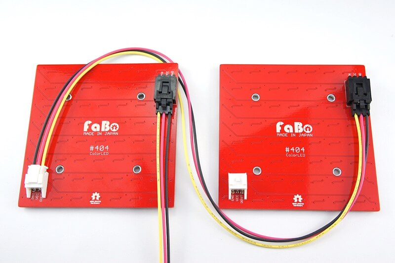
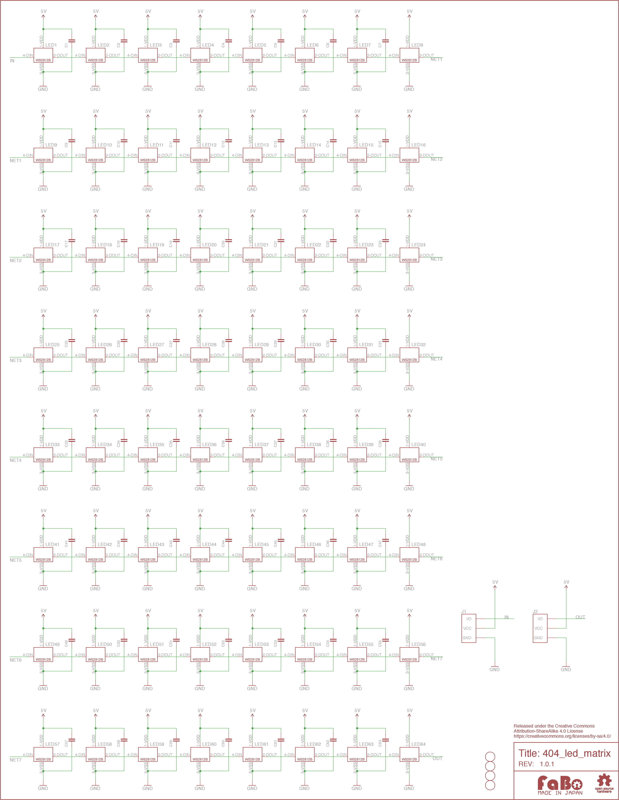

# #404 ColorLED Matrix


<!--COLORME-->

## Overview
RGB Color LEDを使った、8☓8 MatrixのBrickです。

## Connecting
アナログコネクタ(A0〜A5)、またはデジタルコネクタ(2〜13)のどれかに接続します。



Brick裏面にはコネクタが２種類あります。

黒いコネクタをシールドへ接続します。


もう一方の白いコネクタを使って、２枚つなげて使用することができます。


この場合、電流供給量にご注意ください。

点灯させるパターンによりますが、LEDが正常に点灯しなくなるおそれがあります。
また、発熱にも十分ご注意ください。

## Support
|Arduino|RaspberryPI|
|:--:|:--:|
|◯|◯|

## WS2812B Datasheet
|Document|
|--|
|[WS2812B Datasheet](http://www.adafruit.com/datasheets/WS2812B.pdf)|

## 回路図


## Sample Code
### for Arduino
このサンプルコードでは外部ライブラリを使用します。

https://github.com/adafruit/Adafruit_NeoPixel よりAdafruit_NeoPixelライブラリをインストールしてください。

```c
//
// FaBo Brick Sample
//
// brick_3pin_led
//
// Adafruit_NeoPixel Library Downloads
// https://github.com/adafruit/Adafruit_NeoPixel

#include <Adafruit_NeoPixel.h>

int ledPin = A0;
int numPixels = 128;
Adafruit_NeoPixel pixels = Adafruit_NeoPixel(numPixels, ledPin, NEO_GRB + NEO_KHZ800);

void setup() {
  pixels.begin();
  pixels.show();
}

void loop() {
  int i;
  for(i=0; i<pixels.numPixels(); i++) {
    pixels.setPixelColor(i, pixels.Color(32, 0, 0));
  }
  pixels.show();
  delay(500);

  for(i=0; i<pixels.numPixels(); i++) {
    pixels.setPixelColor(i, pixels.Color(0, 32, 0));
  }
  pixels.show();
  delay(500);

  for(i=0; i<pixels.numPixels(); i++) {
    pixels.setPixelColor(i, pixels.Color(0, 0, 32));
  }
  pixels.show();
  delay(500);

}
```

## Parts
- RGB LED WS2812B

## GitHub
- https://github.com/FaBoPlatform/FaBo/tree/master/404_led_matrix
